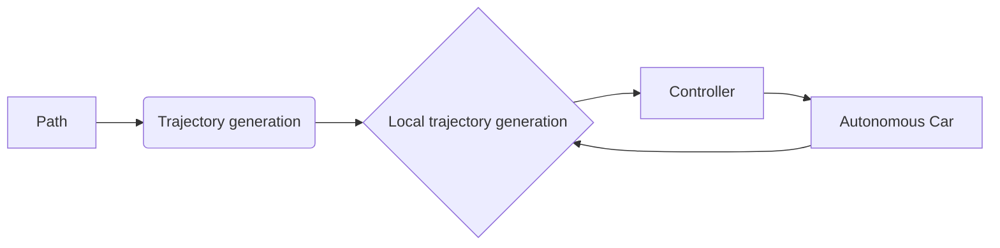
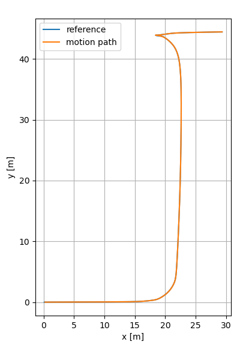

# Tracking controller for Autonomous Car
## Structure


## Prequisites

Install clang-format
```
sudo apt install clang-format-10
sudo ln -s /usr/bin/clang-format-10 /usr/local/bin/clang-format
```

Pre-commit: Check code format before push
```
pip install pre-commit
pre-commit install
pre-commit autoupdate
```

## Build and run

Build
```
./scripts/build.sh
```

Run (build step already included in run script)
```
./scripts/run_example_<name>.sh
```
Visualize results
```
python3 python/visual_path.py       # Plot tracking results
python3 python/visual_animation.py  # Plot animation
```
## Results
